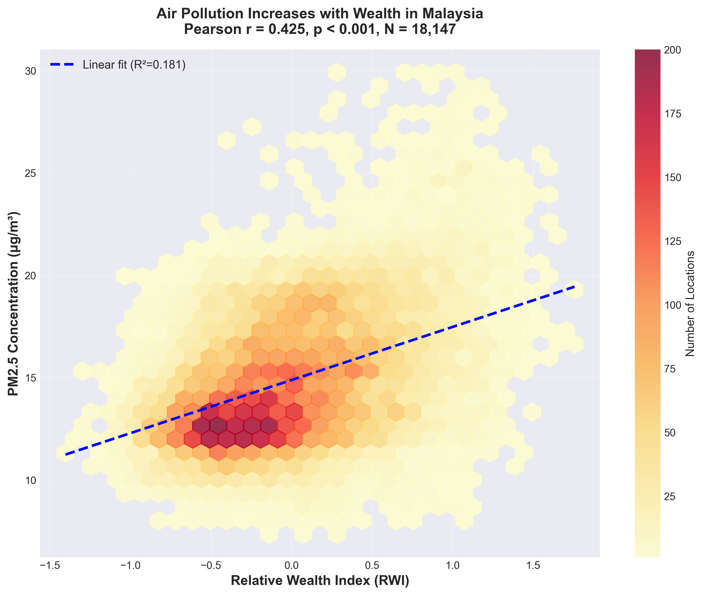
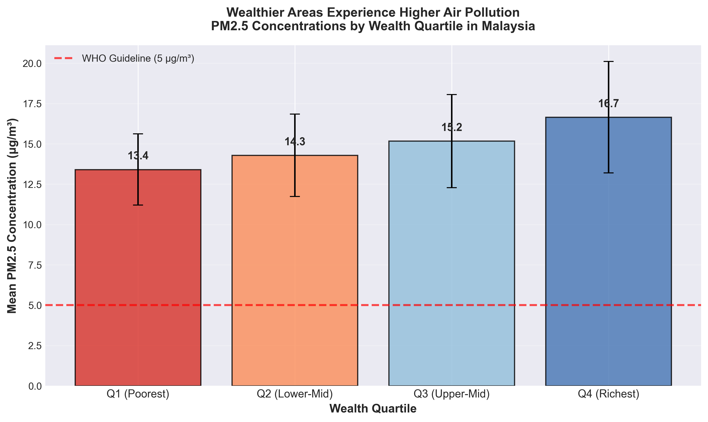
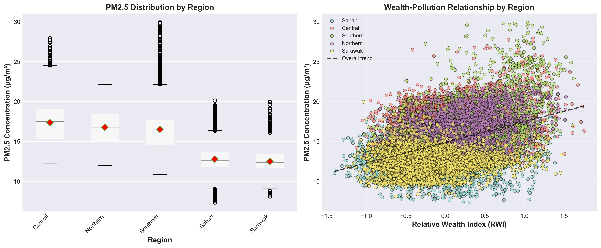

# Air Pollution and Wealth in Malaysia: A Geospatial Analysis

> **Replicating findings from [Behrer & Heft-Neal (2024)](https://www.nature.com/articles/s41893-023-01254-x) published in *Nature Sustainability* for Malaysia**

---

## Overview

This project investigates the relationship between **wealth distribution** and **air pollution exposure** across Malaysia, replicating the methodology from Behrer & Heft-Neal's groundbreaking 2024 study in *Nature Sustainability*.

### The Research Question

**Do wealthier areas in Malaysia experience higher air pollution?**

Contrary to what's typically observed in high-income countries (where poorer communities face higher pollution), this analysis explores whether Malaysia follows the pattern found in most low- and middle-income countries (LMICs), where economic opportunities and pollution are both concentrated in urban centers.

---

## Key Findings

### Wealthier areas experience **34% higher air pollution**

- **Positive correlation** between wealth and PM2.5 pollution (r = 0.43, p < 0.001)
- **18,147 locations** analyzed across Malaysia
- **All areas exceed WHO guidelines** (5 μg/m³ annual mean)
- Richest quartile: ~17 μg/m³ vs Poorest quartile: ~13 μg/m³

---

## Visualizations

### Correlation Analysis

*Positive relationship between wealth (RWI) and air pollution (PM2.5). Each hexagon represents the density of data points at that location.*

### Wealth Quartile Comparison

*Wealthier areas (Q4) experience significantly higher PM2.5 pollution than poorer areas (Q1). All areas exceed WHO air quality guidelines.*

### Regional Patterns

*Distribution of PM2.5 levels across different regions of Malaysia. The wealth-pollution relationship varies by geography, with urban centers showing the strongest correlation.*

### Interactive Map

*Explore the geographic distribution of pollution and wealth across Malaysia with an interactive map featuring district-level boundaries, hover tooltips, and multiple visualization modes (bubble map and heatmap).*

---

## How I Did It

### Data Sources

**1. Relative Wealth Index (RWI)**
- Source: Meta Data for Good
- 18,147 locations across Malaysia
- ~2.4 km resolution

**2. PM2.5 Satellite Data**
- Source: WUSTL Atmospheric Composition Analysis Group
- Global coverage at 0.01° resolution (~1.1 km)
- Annual average for 2021

### Analysis Pipeline

1. **Spatial Matching** - Used K-D tree algorithm to match each wealth location to the nearest PM2.5 measurement (mean distance: 0.42 km)

2. **Statistical Analysis** - Calculated correlation, linear regression, and quartile-based comparisons

3. **Visualization** - Created interactive dashboards and publication-quality plots to communicate findings

---

## Tech Stack

### Data Processing
- **Python** - Core programming language
- **Pandas** - Data manipulation and analysis
- **NumPy** - Numerical computations
- **Xarray** - Multi-dimensional geospatial data handling
- **NetCDF4** - Climate/environmental data format
- **SciPy** - K-D tree spatial indexing and statistical functions

### Visualization
- **Plotly** - Interactive web-based dashboards
- **Matplotlib** - Publication-quality static plots
- **Seaborn** - Statistical visualizations
- **Leaflet.js** - Interactive maps with basemap tiles

### Development
- **Jupyter Notebook** - Interactive analysis and exploration
  
---

## Project Files
```
📁 malaysia-air-pollution-wealth/
├── analysis.ipynb                    # Main analysis notebook
├── malaysia_map_interactive.html    # Interactive geographic map
├── dashboard.html                    # 6-panel analysis dashboard
├── 📁 plots/
│   ├── correlation_plot.png            # Wealth vs pollution scatter
│   ├── quartile_comparison.png         # Quartile bar chart
│   └── regional_analysis.png           # Regional box plots
├── malaysia_rwi_pm25_merged.csv     # Processed dataset
└── README.md                       
```

---

## Key Takeaway

This analysis reveals a critical environmental justice issue in Malaysia: **economic opportunity comes at the cost of air quality**. Unlike wealthy nations where affluent residents can afford cleaner neighborhoods, in Malaysia (and most LMICs), people must choose between accessing jobs and services in polluted urban centers or living in cleaner but economically isolated areas.

Understanding these patterns is essential for policymakers to design interventions that promote both economic development and environmental health.

---

## 🔗 Connect

[LinkedIn](https://www.linkedin.com/in/yazidyaakub/)  

---

<p align="center">
  <i>Exploring the intersection of wealth and environmental health through data science</i>
</p>

<p align="center">
  ⭐ If you find this project interesting, please consider giving it a star!
</p>
